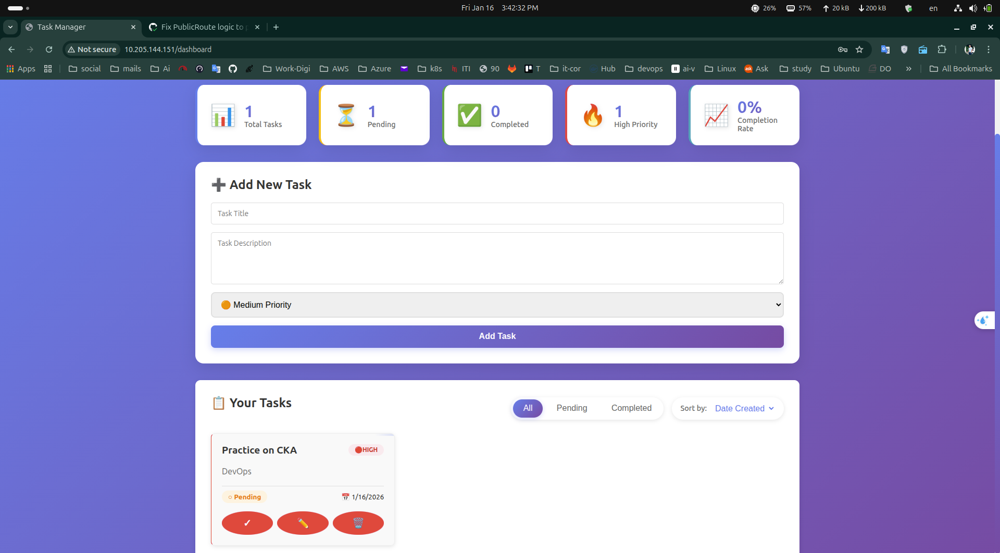
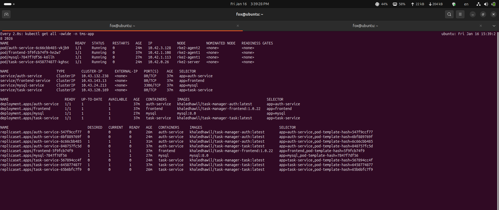
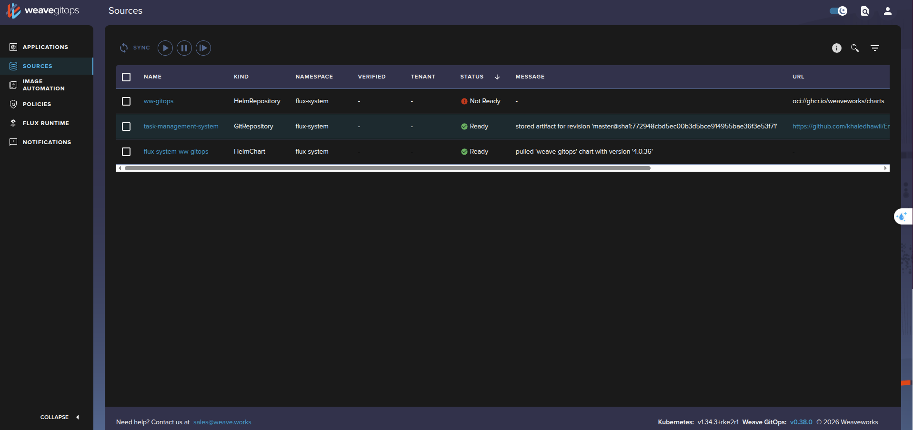
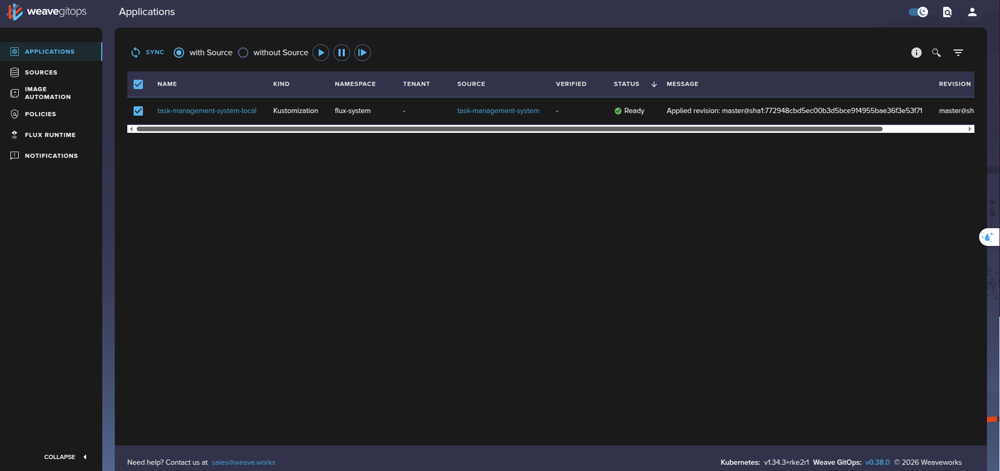
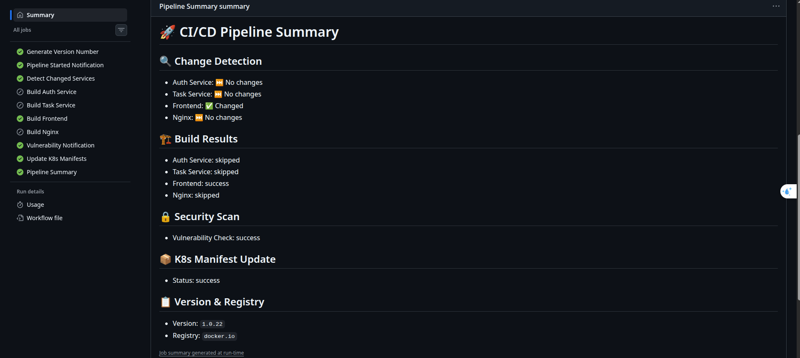
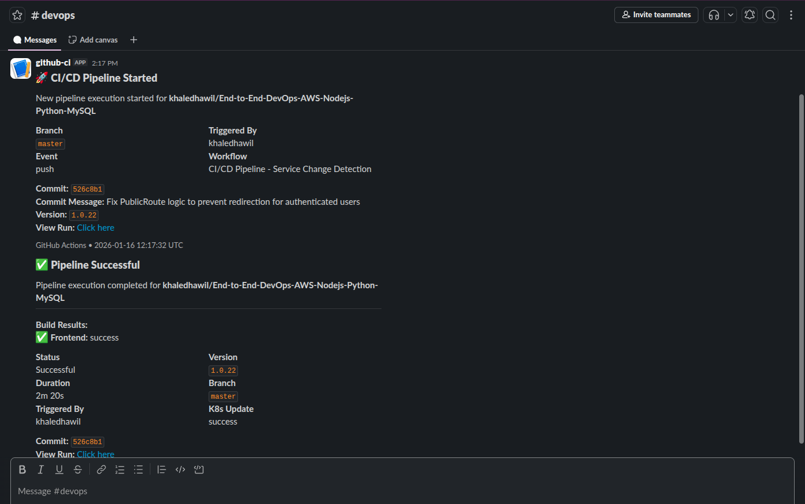

# Task Management System - End-to-End DevOps Project

A production-grade, cloud-native task management application demonstrating modern DevOps practices with complete CI/CD automation, Kubernetes orchestration, GitOps workflows, and security hardening.

---

## Table of Contents

1. [Project Overview](#project-overview)
2. [Architecture](#architecture)
3. [Technology Stack](#technology-stack)
4. [Project Structure](#project-structure)
5. [DevOps Workflow](#devops-workflow)
6. [Step-by-Step Setup Guide](#step-by-step-setup-guide)
   - [Phase 1: Local Development](#phase-1-local-development)
   - [Phase 2: Kubernetes Cluster Setup](#phase-2-kubernetes-cluster-setup)
   - [Phase 3: GitOps with Flux CD](#phase-3-gitops-with-flux-cd)
   - [Phase 4: CI/CD Pipeline](#phase-4-cicd-pipeline)
   - [Phase 5: Monitoring Stack](#phase-5-monitoring-stack)
7. [Security Implementation](#security-implementation)
8. [Troubleshooting](#troubleshooting)

---

## Project Overview

This project demonstrates a complete DevOps lifecycle for a microservices-based task management application. It covers:

- Containerized microservices (Node.js, Python, React)
- Kubernetes deployment on RKE2 cluster
- GitOps continuous deployment with Flux CD
- CI/CD automation with GitHub Actions
- Monitoring with Prometheus and Grafana
- Security hardening at application and infrastructure levels

---

## Architecture

### High-Level System Architecture

```
+-----------------------------------------------------------------------------------+
|                              DEVELOPER WORKSTATION                                |
|   [Code Changes] --> [Git Push] --> [GitHub Repository]                          |
+-----------------------------------------------------------------------------------+
                                        |
                                        v
+-----------------------------------------------------------------------------------+
|                              CI/CD PIPELINE (GitHub Actions)                      |
|                                                                                   |
|   +-------------+    +---------------+    +---------------+    +---------------+  |
|   | Detect      |--->| Docker Build  |--->|  Security Scan|--->| Update K8s    |  |
|   | Changes     |    | & Push        |    | Trivy         |    | Manifests     |  |
|   +-------------+    +---------------+    +---------------+    +---------------+  |
|                                                                        |          |
+------------------------------------------------------------------------|----------+
                                                                         |
                                                                         v
+-----------------------------------------------------------------------------------+
|                              KUBERNETES CLUSTER (RKE2)                            |
|                                                                                   |
|   +-------------+         +-------------------------------------------------+     |
|   | Flux CD     |-------->|                 tms-app Namespace               |     |
|   | Controller  |         |                                                 |     |
|   +-------------+         |   +----------+  +-------------+  +------------+ |     |
|                           |   | Frontend |  | Auth Service|  | Task Svc   | |     |
|                           |   | (React)  |  | (Node.js)   |  | (Python)   | |     |
|                           |   +----------+  +-------------+  +------------+ |     |
|                           |        |              |               |         |     |
|                           |        v              v               v         |     |
|                           |   +----------------------------------------+    |     |
|                           |   |              MySQL Database            |    |     |
|                           |   +----------------------------------------+    |     |
|                           +-------------------------------------------------+     |
|                                                                                   |
|   +-------------+         +-------------------------------------------------+     |
|   | Prometheus  |-------->|             monitoring Namespace                |     |
|   | Operator    |         |   +----------+  +-------------+  +------------+ |     |
|   ---------------         |   | Prometheus|  | Grafana     | | Alert Mgr  | |     |
|                           |   +----------+  +-------------+  +------------+ |     |
|                           +-------------------------------------------------+     |
+-----------------------------------------------------------------------------------+
```

### Microservices Architecture

```
                              [Ingress Controller]
                                      |
                                      | HTTPS/HTTP
                                      v
                              +---------------+
                              |    Nginx      |
                              | (Reverse Proxy)|
                              +-------+-------+
                                      |
           +--------------------------|---------------------------+
           |                          |                           |
           v                          v                           v
   +---------------+          +---------------+           +---------------+
   |   Frontend    |          | Auth Service  |           | Task Service  |
   |   (React)     |          |  (Node.js)    |           |   (Python)    |
   |               |          |               |           |               |
   | Port: 80      |          | Port: 8001    |           | Port: 8002    |
   +---------------+          +-------+-------+           +-------+-------+
                                      |                           |
                                      |        JWT Tokens         |
                                      +-------------+-------------+
                                                    |
                                                    v
                                            +---------------+
                                            |    MySQL      |
                                            |   Database    |
                                            |               |
                                            | Port: 3306    |
                                            +---------------+
```

### CI/CD Pipeline Flow

```
+--------+     +----------+     +----------+     +----------+     +----------+
| Code   |---->| GitHub   |---->| GitHub   |---->| Docker   |---->| Flux CD  |
| Commit |     | Repo     |     | Actions  |     | Registry |     | Sync     |
+--------+     +----------+     +----------+     +----------+     +----------+
                                     |                                  |
                                     v                                  v
                               +----------+                       +----------+
                               | Trivy    |                       | K8s      |
                               | Security |                       | Cluster  |
                               | Scan     |                       | Deploy   |
                               +----------+                       +----------+
```

### Kubernetes Cluster Architecture

```
                    +------------------------------------------+
                    |           RKE2 Kubernetes Cluster        |
                    +------------------------------------------+
                    |                                          |
    +---------------+------------------+-------------------+   |
    |               |                  |                   |   |
+---v----+     +----v-----+      +-----v------+            |   |
| Master |     | Worker 1 |      | Worker 2   |            |   |
| Node   |     | Node     |      | Node       |            |   |
|        |     |          |      |            |            |   |
| - API  |     | - Pods   |      | - Pods     |            |   |
| - etcd |     | - Kubelet|      | - Kubelet  |            |   |
| - Ctrl |     |          |      |            |            |   |
+--------+     +----------+      +------------+            |   |
                    |                                          |
                    +------------------------------------------+
```

---

## Technology Stack

### Application Layer

| Service | Technology | Version | Purpose |
|---------|------------|---------|---------|
| Frontend | React + Vite | 5.x | User interface |
| Auth Service | Node.js + Express | 22.x | Authentication and authorization |
| Task Service | Python + Flask | 3.12 | Task CRUD operations |
| Database | MySQL | 8.0 | Data persistence |
| Reverse Proxy | Nginx | 1.27 | Request routing |

### DevOps Tools

| Tool | Purpose | Version |
|------|---------|---------|
| Docker | Container runtime | Latest |
| Kubernetes | Container orchestration | RKE2 |
| Flux CD | GitOps continuous deployment | v2 |
| GitHub Actions | CI/CD automation | - |
| Prometheus | Metrics collection | Latest |
| Grafana | Metrics visualization | Latest |
| Trivy | Security scanning | Latest |
| Helm | Kubernetes package manager | v3 |

### Security Components

| Component | Purpose |
|-----------|---------|
| Helmet | HTTP security headers |
| express-rate-limit | API rate limiting (Node.js) |
| Flask-Limiter | API rate limiting (Python) |
| express-validator | Input validation (Node.js) |
| Pydantic | Input validation (Python) |
| bcrypt | Password hashing |
| JWT | Stateless authentication |
| NetworkPolicy | Pod network isolation |
| RBAC | Kubernetes access control |

---

## Project Structure

```
.
├── .github/
│   ├── workflows/
│   │   ├── ci-cd-pipeline.yml       # Main CI/CD pipeline (1132 lines)
│   │   └── monthly-updates.yml      # Automated dependency updates
│   └── dependabot.yml               # Dependabot configuration
│
├── flux/
│   └── clusters/
│       ├── local/
│       │   ├── git-repository.yaml  # Git source for Flux
│       │   ├── kustomization-app.yaml
│       │   ├── kustomization-monitoring.yaml
│       │   └── weave-gitops-dashboard.yaml
│       ├── staging/
│       └── production/
│
├── k8s/
│   ├── base/                        # Base Kubernetes manifests
│   │   ├── namespace.yaml
│   │   ├── rbac.yaml                # Service accounts and roles
│   │   ├── network-policy.yaml      # Network isolation rules
│   │   ├── pdb.yaml                 # Pod disruption budgets
│   │   ├── hpa.yaml                 # Horizontal pod autoscalers
│   │   ├── frontend-deployment.yaml
│   │   ├── auth-service-deployment.yaml
│   │   ├── task-service-deployment.yaml
│   │   └── kustomization.yaml
│   ├── monitoring/
│   │   ├── namespace.yaml
│   │   ├── helm-repo.yaml
│   │   ├── kube-prometheus-stack.yaml
│   │   └── service-monitors.yaml
│   └── overlays/
│       ├── local/                   # Local environment configs
│       ├── staging/                 # Staging environment configs
│       └── production/              # Production environment configs
│
├── services/
│   ├── auth-service/                # Node.js authentication service
│   │   ├── Dockerfile
│   │   ├── package.json
│   │   └── server.js
│   ├── task-service/                # Python task management service
│   │   ├── Dockerfile
│   │   ├── requirements.txt
│   │   └── app.py
│   ├── frontend/                    # React frontend application
│   │   ├── Dockerfile
│   │   ├── package.json
│   │   └── src/
│   ├── nginx/                       # Nginx reverse proxy
│   │   ├── Dockerfile
│   │   └── nginx.conf
│   └── docker-compose.yml           # Local development
│
├── scripts/
│   └── monthly-update.sh            # Manual update script
│
├── Screenshots/                     # Project screenshots
│   ├── Grafana.png
│   ├── app-on-weavy.png
│   ├── cd-pipline.png
│   ├── k8s-cluster.png
│   ├── pipline-summary.png
│   ├── slack-.png
│   ├── task-app.png
│   └── weavy-gui.png
│
├── RKE2_cluster.md                  # Cluster setup guide
└── README.md                        # This file
```

---

## DevOps Workflow

### Complete DevOps Lifecycle

```
┌────────────────────────────────────────────────────────────────────────────────┐
│                            DevOps Lifecycle                                     │
├────────────────────────────────────────────────────────────────────────────────┤
│                                                                                 │
│  1. DEVELOP        2. BUILD          3. TEST           4. DEPLOY               │
│  ┌─────────┐      ┌─────────┐       ┌─────────┐       ┌─────────┐              │
│  │ Write   │ ──── │ Docker  │ ───── │ Trivy   │ ───── │ Flux CD │              │
│  │ Code    │ Push │ Build   │       │ Scan    │       │ GitOps  │              │
│  └─────────┘      └─────────┘       └─────────┘       └─────────┘              │
│       │                                                     │                   │
│       │           5. OPERATE         6. MONITOR             │                   │
│       │          ┌─────────┐        ┌─────────┐             │                   │
│       └────────  │ Manage  │ ────── │ Prom +  │ ────────────┘                   │
│        Feedback  │ K8s     │        │ Grafana │                                 │
│                  └─────────┘        └─────────┘                                 │
│                                                                                 │
└────────────────────────────────────────────────────────────────────────────────┘
```

---

## Step-by-Step Setup Guide

### Phase 1: Local Development

Local development allows you to test all services on your machine before deploying to Kubernetes.

#### Step 1.1: Clone the Repository

```bash
git clone https://github.com/khaledhawil/End-to-End-DevOps-AWS-Nodejs-Python-MySQL.git
cd End-to-End-DevOps-AWS-Nodejs-Python-MySQL
```

This downloads the complete project source code to your local machine.

#### Step 1.2: Start Services with Docker Compose

```bash
cd services
docker-compose up -d
```

This command starts all services in containers:
- MySQL database on port 3306
- Auth service on port 8001
- Task service on port 8002
- Frontend on port 80 (via Nginx)

#### Step 1.3: Verify Services are Running

```bash
docker-compose ps
```

Expected output shows all services in "running" state.

#### Step 1.4: Access the Application

Open your browser and navigate to:
- Frontend: http://localhost
- Auth API: http://localhost:8001/health
- Task API: http://localhost:8002/health

**Application Screenshot:**



#### Step 1.5: Stop Local Development

```bash
docker-compose down -v
```

This stops all containers and removes volumes.

---

### Phase 2: Kubernetes Cluster Setup

This phase covers setting up a production-ready RKE2 Kubernetes cluster on 3 Ubuntu VMs.

#### Step 2.1: Prepare VMs

Prepare 3 Ubuntu VMs with the following requirements:
- 1 Master Node: 2 CPU, 4GB RAM, 50GB storage
- 2 Worker Nodes: 2 CPU, 4GB RAM, 50GB storage each

Run on all nodes:

```bash
# Update system
sudo apt update && sudo apt upgrade -y

# Disable swap (required for Kubernetes)
sudo swapoff -a
sudo sed -i '/ swap / s/^\(.*\)$/#\1/g' /etc/fstab
```

Swap must be disabled because Kubernetes manages memory allocation directly and swap can interfere with container memory limits.

#### Step 2.2: Set Hostnames

On Master Node:
```bash
sudo hostnamectl set-hostname rke2-master
```

On Worker 1:
```bash
sudo hostnamectl set-hostname rke2-worker1
```

On Worker 2:
```bash
sudo hostnamectl set-hostname rke2-worker2
```

#### Step 2.3: Configure /etc/hosts

Add to all nodes (replace with your IPs):

```bash
sudo nano /etc/hosts
```

```
192.168.1.10  rke2-master
192.168.1.11  rke2-worker1
192.168.1.12  rke2-worker2
```

This enables hostname-based communication between nodes.

#### Step 2.4: Install RKE2 Server (Master Node)

```bash
# Download and install RKE2
curl -sfL https://get.rke2.io | sudo sh -

# Enable and start RKE2 server
sudo systemctl enable rke2-server.service
sudo systemctl start rke2-server.service
```

Wait 2-3 minutes for the server to initialize. RKE2 automatically installs containerd, etcd, and all control plane components.

#### Step 2.5: Get Node Token

On Master Node:

```bash
sudo cat /var/lib/rancher/rke2/server/node-token
```

Save this token - you need it to join worker nodes to the cluster.

#### Step 2.6: Install RKE2 Agent (Worker Nodes)

On each Worker Node:

```bash
# Download and install RKE2 agent
curl -sfL https://get.rke2.io | INSTALL_RKE2_TYPE="agent" sudo sh -

# Configure the agent
sudo mkdir -p /etc/rancher/rke2/
sudo nano /etc/rancher/rke2/config.yaml
```

Add this content (replace with your master IP and token):

```yaml
server: https://192.168.1.10:9345
token: <your-node-token-from-step-2.5>
```

Start the agent:

```bash
sudo systemctl enable rke2-agent.service
sudo systemctl start rke2-agent.service
```

#### Step 2.7: Configure kubectl

On Master Node:

```bash
# Add kubectl to PATH
echo 'export PATH=$PATH:/var/lib/rancher/rke2/bin' >> ~/.bashrc
echo 'export KUBECONFIG=/etc/rancher/rke2/rke2.yaml' >> ~/.bashrc
source ~/.bashrc

# Copy kubeconfig for regular user access
mkdir -p ~/.kube
sudo cp /etc/rancher/rke2/rke2.yaml ~/.kube/config
sudo chown $(id -u):$(id -g) ~/.kube/config
```

#### Step 2.8: Verify Cluster

```bash
kubectl get nodes
```

Expected output shows 3 nodes in "Ready" state.

**Kubernetes Cluster Screenshot:**



---

### Phase 3: GitOps with Flux CD

Flux CD automatically syncs your Kubernetes cluster with the Git repository.

#### Step 3.1: Install Flux CLI

```bash
curl -s https://fluxcd.io/install.sh | sudo bash
```

This installs the Flux command-line tool for managing GitOps workflows.

#### Step 3.2: Export GitHub Token

```bash
export GITHUB_TOKEN=<your-github-personal-access-token>
export GITHUB_USER=<your-github-username>
```

Create a Personal Access Token in GitHub with `repo` permissions.

#### Step 3.3: Bootstrap Flux

```bash
flux bootstrap github \
  --owner=$GITHUB_USER \
  --repository=End-to-End-DevOps-AWS-Nodejs-Python-MySQL \
  --branch=master \
  --path=./flux/clusters/local \
  --personal
```

This command:
1. Installs Flux controllers in your cluster
2. Creates a GitRepository resource pointing to your repo
3. Sets up Kustomization resources to deploy your manifests

#### Step 3.4: Verify Flux Installation

```bash
flux check
```

All components should show as "ready".

#### Step 3.5: Monitor Reconciliation

```bash
flux get kustomizations --watch
```

Watch Flux deploy your application automatically.

**Flux/Weave GitOps Dashboard Screenshot:**



**Application Deployed via GitOps Screenshot:**



#### Step 3.6: Access Weave GitOps Dashboard (Optional)

```bash
kubectl port-forward svc/weave-gitops -n flux-system 9001:9001
```

Open http://localhost:9001 in your browser.

---

### Phase 4: CI/CD Pipeline

The GitHub Actions pipeline automates building, testing, and deploying your application.

#### Step 4.1: Configure GitHub Secrets

Navigate to your repository Settings > Secrets and variables > Actions.

Add these secrets:

| Secret Name | Description |
|-------------|-------------|
| DOCKER_USERNAME | Your Docker Hub username |
| DOCKER_PASSWORD | Your Docker Hub password or access token |
| SLACK_WEBHOOK_URL | (Optional) Slack webhook for notifications |

#### Step 4.2: Pipeline Trigger

The pipeline triggers automatically when you push changes to:
- `services/auth-service/**`
- `services/task-service/**`
- `services/frontend/**`
- `services/nginx/**`

#### Step 4.3: Pipeline Stages Explanation

**Stage 1: Generate Version**
```yaml
version: ${{ env.VERSION_MAJOR }}.${{ env.VERSION_MINOR }}.${{ github.run_number }}
```
Creates semantic version like `1.0.25` based on run number.

**Stage 2: Detect Changes**
Uses `dorny/paths-filter` to determine which services changed. Only changed services are rebuilt, saving time and resources.

**Stage 3: Security Scan**
```yaml
- name: Run Trivy vulnerability scanner
  uses: aquasecurity/trivy-action@master
  with:
    scan-type: 'fs'
    severity: 'CRITICAL,HIGH'
```
Scans code for vulnerabilities before building.

**Stage 4: Build and Push**
```yaml
- name: Build and push Docker image
  uses: docker/build-push-action@v5
  with:
    push: true
    tags: ${{ env.DOCKER_USERNAME }}/task-manager-auth:${{ needs.generate-version.outputs.version }}
```
Builds Docker images and pushes to Docker Hub.

**Stage 5: Update Manifests**
Automatically updates Kubernetes deployment files with new image tags and commits back to the repository.

**Stage 6: Slack Notification**
Sends pipeline status to Slack channel.

**Pipeline Summary Screenshot:**



**CD Pipeline Screenshot:**


**Slack Notification Screenshot:**



#### Step 4.4: Manual Pipeline Trigger

You can also trigger the pipeline manually:

1. Go to Actions tab in GitHub
2. Select "CI/CD Pipeline - Service Change Detection"
3. Click "Run workflow"

---

### Phase 5: Monitoring Stack

Prometheus and Grafana provide observability for your cluster and applications.

#### Step 5.1: Monitoring Components

The monitoring stack is deployed automatically via Flux:

- **Prometheus**: Collects and stores metrics
- **Grafana**: Visualizes metrics in dashboards
- **AlertManager**: Routes alerts to Slack, email, etc.

#### Step 5.2: Access Grafana

```bash
kubectl port-forward svc/kube-prometheus-stack-grafana -n monitoring 3000:80
```

Open http://localhost:3000

Default credentials:
- Username: `admin`
- Password: `admin123`

#### Step 5.3: Pre-configured Dashboards

Grafana includes dashboards for:
- Kubernetes cluster overview
- Node metrics (CPU, memory, disk)
- Pod metrics
- Application metrics via ServiceMonitors

**Grafana Dashboard Screenshot:**


#### Step 5.4: Configure ServiceMonitors

ServiceMonitors tell Prometheus which endpoints to scrape:

```yaml
apiVersion: monitoring.coreos.com/v1
kind: ServiceMonitor
metadata:
  name: auth-service-monitor
  namespace: tms-app
spec:
  selector:
    matchLabels:
      app: auth-service
  endpoints:
    - port: http
      path: /metrics
      interval: 30s
```

#### Step 5.5: Create Custom Alerts

Add alerting rules in Prometheus:

```yaml
groups:
  - name: application
    rules:
      - alert: HighErrorRate
        expr: rate(http_requests_total{status="500"}[5m]) > 0.1
        for: 5m
        labels:
          severity: critical
        annotations:
          summary: High error rate detected
```

---

## Security Implementation

### Application Security

| Feature | Implementation |
|---------|----------------|
| Password Hashing | bcrypt with salt rounds |
| Authentication | JWT tokens with expiration |
| Rate Limiting | 5 login attempts per 15 minutes |
| Input Validation | express-validator and Pydantic |
| Security Headers | Helmet middleware (CSP, HSTS, XSS) |
| CORS | Configurable allowed origins |

### Kubernetes Security

| Feature | Implementation |
|---------|----------------|
| Network Policies | Zero-trust model with explicit allow rules |
| RBAC | Least-privilege ServiceAccounts |
| Security Context | Non-root containers, dropped capabilities |
| Pod Disruption Budgets | Ensures availability during updates |
| Secrets Management | Kubernetes Secrets for sensitive data |

### Container Security

| Feature | Implementation |
|---------|----------------|
| Base Images | Alpine-based minimal images |
| Non-root User | All containers run as UID 1000 |
| Read-only Filesystem | Where applicable |
| Image Scanning | Trivy in CI/CD pipeline |
| No Privileged Containers | allowPrivilegeEscalation: false |

---

## Troubleshooting

### Common Issues

**1. Pods not starting**

```bash
kubectl describe pod <pod-name> -n tms-app
kubectl logs <pod-name> -n tms-app
```

Check events and logs for error messages.

**2. Database connection failures**

```bash
kubectl get pods -n tms-app -l app=mysql
kubectl logs -l app=mysql -n tms-app
```

Ensure MySQL pod is running and secrets are correctly configured.

**3. Flux not syncing**

```bash
flux get sources git
flux get kustomizations
flux logs --level=error
```

Check Git repository connectivity and Kustomization errors.

**4. Pipeline failures**

Check GitHub Actions logs for specific error messages. Common issues:
- Missing secrets (DOCKER_USERNAME, DOCKER_PASSWORD)
- Dockerfile syntax errors
- Trivy security scan blocking critical vulnerabilities

### Health Check Commands

```bash
# Cluster health
kubectl get nodes
kubectl get pods -A

# Application health
kubectl get pods -n tms-app
kubectl get svc -n tms-app
kubectl get ingress -n tms-app

# Flux health
flux check
flux get all

# Monitoring health
kubectl get pods -n monitoring
```

---

## API Reference

### Auth Service Endpoints

| Method | Endpoint | Description | Rate Limit |
|--------|----------|-------------|------------|
| POST | /register | Register new user | 3/hour |
| POST | /login | Authenticate user | 5/15min |
| POST | /verify | Verify JWT token | 100/15min |
| GET | /health | Health check | Unlimited |

### Task Service Endpoints

| Method | Endpoint | Description | Rate Limit |
|--------|----------|-------------|------------|
| GET | /tasks | List user tasks | 100/15min |
| POST | /tasks | Create task | 20/min |
| PUT | /tasks/:id | Update task | 100/15min |
| DELETE | /tasks/:id | Delete task | 100/15min |
| GET | /health | Health check | Unlimited |

---

## Environment Variables

### Auth Service

| Variable | Description | Default |
|----------|-------------|---------|
| PORT | Service port | 8001 |
| DB_HOST | MySQL hostname | mysql |
| DB_USER | MySQL username | root |
| DB_PASS | MySQL password | - |
| DB_NAME | Database name | task_manager |
| JWT_SECRET | Token signing key | - |

### Task Service

| Variable | Description | Default |
|----------|-------------|---------|
| PORT | Service port | 8002 |
| DB_HOST | MySQL hostname | mysql |
| DB_USER | MySQL username | root |
| DB_PASS | MySQL password | - |
| DB_NAME | Database name | task_manager |
| JWT_SECRET | Token signing key | - |

---

## Contributing

1. Fork the repository
2. Create a feature branch (`git checkout -b feature/new-feature`)
3. Commit changes (`git commit -m 'Add new feature'`)
4. Push to branch (`git push origin feature/new-feature`)
5. Open a Pull Request

---

## License

This project is licensed under the MIT License.

---

## Author

**Khaled Hawil**

---

## Acknowledgments

- Kubernetes and RKE2 documentation
- Flux CD project maintainers
- GitHub Actions team
- Prometheus and Grafana communities
